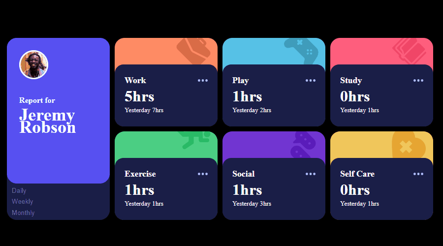

# Desafio Time Tracking Dashboard do site frontendmentor.io


## Descrição:
Página responsiva para diversas telas. Exibe horas empregadas em cada tópico por dia semana e mes.\
<a href="https://femtimetrackingdashboard.netlify.app/">Link do site, veja o responsivo</a>

## Indice
- <a href="#aprendizagens">Aprendizagens e desafios</a>
- <a href="#funcionalidades"> Funcionalidades </a>
- <a href="#tecnologias"> Tecnologias </a>
- <a href="#rodar"> Como rodar? </a>
- <a href="#colaboradores"> Colaboradores </a>
- <a href="#next"> Proximos passos </a>
- <a href="#contato"> Contatos </a>

## Aprendizagens
- [x] A maior parte da tipagem typescript foi inferida com alguns componentes mais especificados.
- [x] Utilização do json simulando um banco de dados.
- [x] Primeira utilização do grid combinado com flex box com responsivo adaptado a diversos tamanhos.
- [x] Por não haver evolução de estado foi empregado context API para estados globais.

## Funcionalidades
- [x] Botões de alteração de horas gastas por tópico separando por total diário, total semanal e total mensal.

## Tecnologias
1. [React](https://pt-br.reactjs.org)
2. [Grid CSS](https://developer.mozilla.org/pt-BR/docs/Web/CSS/CSS_Grid_Layout/)
3. [Flexbox CSS](https://developer.mozilla.org/pt-BR/docs/Web/CSS/CSS_Flexible_Box_Layout/Basic_Concepts_of_Flexbox/)
4. [Typescript](https://www.typescriptlang.org/docs/)
5. [Context API](https://legacy.reactjs.org/docs/context.html/)

## rodar
```bash
# Projeto inicializado com Create React App
# https://github.com/facebook/create-react-app

# Clone o repositório na pasta desejada
$ git clone https://github.com/vitorhub/time-tracking-dashboard.git

# Acesse a pasta do projeto no seu terminal
$ cd time-tracking-dashboard/

# Instale as dependencias
$ npm install

# Inicialize o projeto no navegador
$ npm start

# Para criar o arquivo de produção
$ npm run build

# A aplicação será acessada na porta 3000,
acesse pelo navegador: http://localhost:3000
```

## Colaboradores
Vitor Falcao\


## next
- [ ] Aprofundamento da tipagem de elementos DOM.
- [ ] Substituir o arquivo json por um banco de dados

## Contato
<a href="https://www.linkedin.com/in/vitorfalcaodesenvolvedor/"> Linkedin </a>
